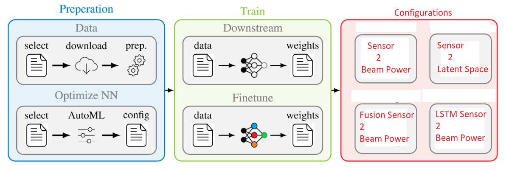

## Part of the BeamBench Framework
BeamBench Framework by Maximilian Arnold for evaluating multi-modal beam prediction.
<div align="center">

</div>

## Installation
NOTE: This is for Ubunutu 18.04 with CUDA 11.4!


### Build docker
```
docker build -t beambench .
```

### Run docker
```
chmod +x run_docker.sh
./run_docker
```

## CD to your code folder
```
cd /workspace/home/.../challenge_net/
```
### Download the models from 
```
cd /workspace/home/.../challenge_net/
```
and put them into 
```
results/models
```

### Evaluate the models
Run the function
```
python3 challenge.py --gpu_id 0  --data_folder ./raw_data/test/ --csv ml_challenge_test_multi_modal.csv 
```
Please update the raw test folder directory and the name if you changed the csv(normally not)

### Support
Please let me know if the code doesnt work for you under:
```
maximilian.wolfgang.arnold@gmail.com
```
